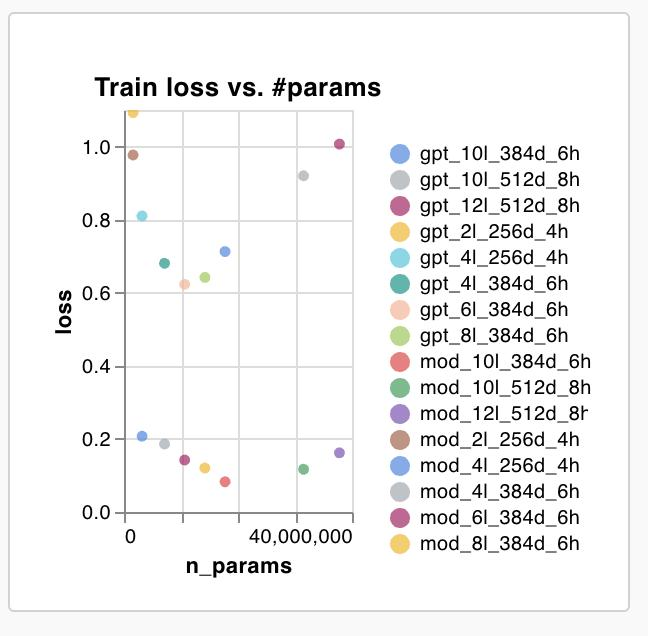
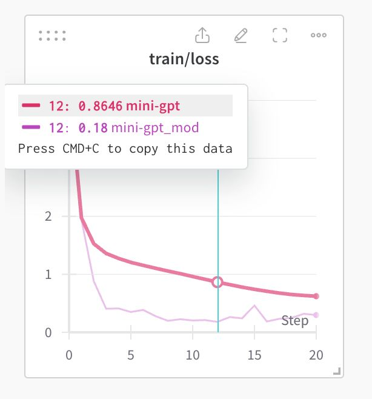

# nanoMoD



This is a super minimal implementation of [Mixture-of-Depths](https://arxiv.org/abs/2404.02258) (MoD) on top of Andrej Karpathy's amazing nanoGPT [repository](https://github.com/karpathy/nanoGPT). 

All usage and script invocations are identical to the original codebase. The main addition is the following MoD module:

```python
class MoDBlock(nn.Module):

  def __init__(self, config):
    super().__init__()
    self.router = nn.Linear(config.n_embd, 1, bias=False)
    self.block = Block(config)
    self.capacity = config.capacity

  def forward(self, x_BTD):
    B, T, D = x_BTD.shape
    router_scores_BT = self.router(x_BTD).squeeze(2)
    top_rvals_BK, top_ridxs_BK = torch.topk(router_scores_BT, self.capacity, dim=1)
    batch_indices_BK = torch.arange(B).unsqueeze(1).expand(B, self.capacity)
    x_BKD = x_BTD[batch_indices_BK, top_ridxs_BK]
    x_BKD = top_rvals_BK[..., None] * self.block(x_BKD)[0] + x_BKD
    out_BTD = x_BTD.scatter(1, top_ridxs_BK[..., None].expand(-1, -1, x_BTD.shape[-1]), x_BKD)
    return out_BTD
```

I've only tried out small-scale experiments on the Shakespeare corpus, but results seem consistent with those reported in the MoD paper. You can initiate training with the following command: `python train.py config/train_shakespeare_char.py`. 


A major TODO right now is to implement autoregressive sampling. Have fun! 


